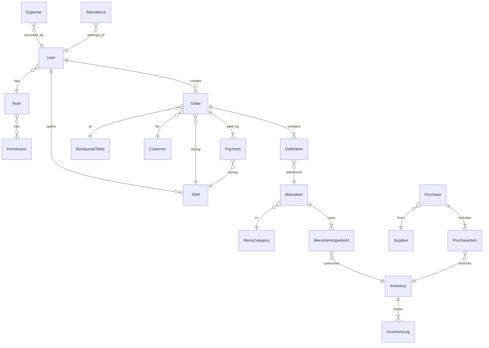

# KryzoraPOS — ULTRA DEEP SYSTEM AUDIT REPORT

> **Auditor**: Senior Engineer Pre-Launch Audit  
> **Date**: 2026-04-07  
> **System**: KryzoraPOS v2.0.0 by Kryzora Solutions  
> **Stack**: Laravel 11 (PHP) + React 19 (Vite) + Electron 40 + SQLite  

---

## 1. FULL SYSTEM OVERVIEW

### Architecture Summary

```
┌────────────────────────────────────────────────┐
│                  ELECTRON SHELL                │
│  main.js → spawns PHP CLI server + loads UI    │
├──────────────────┬─────────────────────────────┤
│   FRONTEND       │        BACKEND              │
│   React 19       │        Laravel 11           │
│   Vite + JSX     │        PHP built-in server  │
│   Port 3000(dev) │        Port 8111            │
│   HashRouter     │        SQLite DB            │
│   Axios → API    │        Sanctum Auth         │
└──────────────────┴─────────────────────────────┘
```

### Folder Structure

```
d:\Kryzora POS\
├── backend\              (Laravel 11 API)
│   ├── app\
│   │   ├── Console\Commands\    (2 commands: AutoBackup, SyncOrdersToCloud)
│   │   ├── Http\
│   │   │   ├── Controllers\Api\ (17 controllers)
│   │   │   └── Middleware\      (2: CheckLicense, CheckPermission)
│   │   ├── Models\              (23 models)
│   │   ├── Providers\           (1 provider)
│   │   ├── Services\            (2: LicenseService, FBRService)
│   │   └── Utils\               (1: Audit)
│   ├── config\                  (12 config files)
│   ├── database\
│   │   ├── migrations\          (38 migration files)
│   │   ├── seeders\             (3 seeders)
│   │   ├── KryzoraPOS.sqlite    (319 KB — active)
│   │   └── database.sqlite      (921 KB — STALE / OLD)
│   ├── routes\api.php           (176 lines, all routes)
│   └── .env                     (production config committed!)
├── frontend\             (React 19 + Vite)
│   ├── src\
│   │   ├── pages\               (20 page components)
│   │   ├── components\          (2: Layout, Receipt)
│   │   ├── context\             (1: AuthContext)
│   │   ├── hooks\               (EMPTY)
│   │   ├── utils\               (1: whatsapp.js)
│   │   ├── App.jsx              (main router)
│   │   ├── api.js               (axios instance)
│   │   ├── main.jsx             (entry point)
│   │   └── index.css            (66 KB monolith)
│   └── dist\                    (production build output)
├── electron\             (Electron 40 desktop wrapper)
│   ├── main.js                  (358 lines)
│   ├── package.json             (builder config)
│   ├── BUILD_EXE.bat            (NSIS builder script)
│   └── php\                     (bundled PHP runtime)
├── backups\                     (backup storage)
├── BUILD_PRODUCTION.bat         (build pipeline)
└── FINAL_SUMMARY.md / POS_GUIDE.md / etc.
```

---

## 2. FILE-BY-FILE KEY FINDINGS

### Backend: Critical Files

| File | Purpose | Status | Issues |
|------|---------|--------|--------|
| [api.php](file:///d:/Kryzora%20POS/backend/routes/api.php) | All API routes | ✅ Working | Well-organized with license/feature gating |
| [.env](file:///d:/Kryzora%20POS/backend/.env) | Environment config | ⚠️ **COMMITTED TO REPO** | **APP_KEY exposed**, production secrets in version control |
| [POSController.php](file:///d:/Kryzora%20POS/backend/app/Http/Controllers/Api/POSController.php) | Order CRUD + Payments | ✅ Working | Complex but functional; proper transactions |
| [AuthController.php](file:///d:/Kryzora%20POS/backend/app/Http/Controllers/Api/AuthController.php) | Login/Logout/License | ✅ Working | Clean implementation |
| [LicenseService.php](file:///d:/Kryzora%20POS/backend/app/Services/LicenseService.php) | License validation | ⚠️ Functional but **BYPASSABLE** | HMAC key = APP_KEY (exposed in .env); see §8 |
| [FBRService.php](file:///d:/Kryzora%20POS/backend/app/Services/FBRService.php) | FBR tax integration | ⚠️ **STUB ONLY** | Mock implementation, no real API calls |
| [CheckLicense.php](file:///d:/Kryzora%20POS/backend/app/Http/Middleware/CheckLicense.php) | License middleware | ✅ Working | Clean feature-gating logic |
| [CheckPermission.php](file:///d:/Kryzora%20POS/backend/app/Http/Middleware/CheckPermission.php) | Permission middleware | ✅ Working | — |
| [ShiftController.php](file:///d:/Kryzora%20POS/backend/app/Http/Controllers/Api/ShiftController.php) | Shift management | ✅ Working | Well-structured with daily report |
| [ReportController.php](file:///d:/Kryzora%20POS/backend/app/Http/Controllers/Api/ReportController.php) | Reports & analytics | ✅ Working | Good profit calculations |
| [InventoryController.php](file:///d:/Kryzora%20POS/backend/app/Http/Controllers/Api/InventoryController.php) | Inventory CRUD | ✅ Working | Audit logging included |
| [MenuController.php](file:///d:/Kryzora%20POS/backend/app/Http/Controllers/Api/MenuController.php) | Menu CRUD + ingredients | ✅ Working | Image upload + audit trail |
| [KitchenController.php](file:///d:/Kryzora%20POS/backend/app/Http/Controllers/Api/KitchenController.php) | Kitchen display | ⚠️ Partial | SSE `stream()` was gutted — now identical to `index()` |
| [BackupController.php](file:///d:/Kryzora%20POS/backend/app/Http/Controllers/Api/BackupController.php) | DB backup download | ✅ Working | Simple but effective |
| [AutoBackup.php](file:///d:/Kryzora%20POS/backend/app/Console/Commands/AutoBackup.php) | Auto backup command | ❌ **BROKEN** | Uses `DIRECTORY_PATH_SEPARATOR` (undefined constant — should be `DIRECTORY_SEPARATOR`) |
| [SyncOrdersToCloud.php](file:///d:/Kryzora%20POS/backend/app/Console/Commands/SyncOrdersToCloud.php) | Cloud sync command | ⚠️ **MOCK** | Simulation only, no real cloud endpoint |
| [License.php](file:///d:/Kryzora%20POS/backend/app/Models/License.php) (Model) | License model | ❌ **DEAD CODE** | Never used anywhere — system uses `Setting` table instead |
| [Audit.php](file:///d:/Kryzora%20POS/backend/app/Utils/Audit.php) | Audit logger | ✅ Working | Silently swallows exceptions |

### Backend: Models

| Model | Status | Issues |
|-------|--------|--------|
| Order | ⚠️ | Missing `fbr_invoice_number`, `order_number`, `is_synced`, `order_source`, `delivery_address`, `notes` from `$fillable` |
| User | ✅ | — |
| Shift | ✅ | `cash_total`, `card_total`, etc. are computed accessors — correct |
| Payment | ✅ | — |
| MenuItem | ✅ | `image_url` accessor works |
| Inventory | ✅ | Explicit `$table` set correctly |
| OrderItem | ✅ | `menu_item` relationship uses snake_case method name (matches frontend expectations) |
| Setting | ✅ | Minimal model, fine for KV store |
| License | ❌ Dead | Has `isValid()` method but model is never instantiated |
| Expense | ✅ | — |
| ActivityLog | ✅ | — |
| Role/Permission | ✅ | Pivot relationship via `role_permission` |
| MenuCategory | ✅ | — |
| MenuItemIngredient | ✅ | — |
| Customer, Supplier, Rider, Attendance, etc. | ✅ | All functional |
| Purchase/PurchaseItem | ✅ | — |
| RestaurantTable | ✅ | — |

### Frontend: Key Files

| File | Purpose | Status | Issues |
|------|---------|--------|--------|
| [App.jsx](file:///d:/Kryzora%20POS/frontend/src/App.jsx) | Main router | ✅ Working | Feature-locking gate works, lazy loading |
| [api.js](file:///d:/Kryzora%20POS/frontend/src/api.js) | Axios client | ⚠️ | Hardcoded `http://127.0.0.1:8111`; 403 handler clears auth & redirects |
| [AuthContext.jsx](file:///d:/Kryzora%20POS/frontend/src/context/AuthContext.jsx) | Auth state | ⚠️ | Retries 15 times waiting for backend; user parsed from localStorage without validation |
| [Layout.jsx](file:///d:/Kryzora%20POS/frontend/src/components/Layout.jsx) | Sidebar/header | ✅ | Dynamic restaurant name, alert badges |
| [Receipt.jsx](file:///d:/Kryzora%20POS/frontend/src/components/Receipt.jsx) | Print receipt | ✅ | Thermal receipt format, settings-driven |
| [whatsapp.js](file:///d:/Kryzora%20POS/frontend/src/utils/whatsapp.js) | WhatsApp sharing | ✅ | Pakistan phone formatting done right |
| [index.css](file:///d:/Kryzora%20POS/frontend/src/index.css) | ALL styles | ⚠️ | **66KB monolith** CSS file — no modularization |
| [POS.jsx](file:///d:/Kryzora%20POS/frontend/src/pages/POS.jsx) | POS screen | ✅ | 31KB, comprehensive but very large |
| [LicenseActivation.jsx](file:///d:/Kryzora%20POS/frontend/src/pages/LicenseActivation.jsx) | License entry | ✅ | Clean 3-plan activation screen |
| `hooks/` directory | Custom hooks | ❌ **EMPTY** | No custom hooks despite complex state management |
| 20 page components | All feature pages | ✅ Mostly working | Large single-file components (no decomposition) |

### Electron

| File | Purpose | Status | Issues |
|------|---------|--------|--------|
| [main.js](file:///d:/Kryzora%20POS/electron/main.js) | Electron main process | ⚠️ | See §5 for race conditions |
| [package.json](file:///d:/Kryzora%20POS/electron/package.json) | Build config | ✅ | NSIS installer, comprehensive `extraResources` filters |
| [BUILD_EXE.bat](file:///d:/Kryzora%20POS/electron/BUILD_EXE.bat) | Build script | ✅ | Admin elevation, prereq checks |

---

## 3. MODULE STATUS TABLE

| # | Module | Backend | Frontend | Status | Completeness |
|---|--------|---------|----------|--------|--------------|
| 1 | **POS / Sales** | ✅ Full CRUD, split billing, refunds | ✅ Full UI, cart, payment modal | 🟢 Working | **90%** |
| 2 | **Inventory** | ✅ CRUD, stock tracking, logs | ✅ Full UI, low stock alerts | 🟢 Working | **85%** |
| 3 | **Kitchen Display** | ⚠️ SSE gutted, polling only | ✅ Basic UI | 🟡 Partial | **60%** |
| 4 | **Reports** | ✅ Daily/weekly/top items/CSV | ✅ Charts (Recharts), export | 🟢 Working | **80%** |
| 5 | **Users / Roles** | ✅ RBAC with permissions | ✅ Staff CRUD UI | 🟢 Working | **85%** |
| 6 | **Payments** | ✅ Cash/card/easypaisa/jazzcash, split | ✅ Payment modal | 🟢 Working | **85%** |
| 7 | **Settings** | ✅ KV store, tax/FBR/receipt config | ✅ Settings page | 🟢 Working | **80%** |
| 8 | **License System** | ⚠️ HMAC-based, bypassable | ✅ Activation screen | 🟡 Partial | **70%** |
| 9 | **Menu Management** | ✅ Categories, items, ingredients, images | ✅ Full CRUD UI | 🟢 Working | **90%** |
| 10 | **Customer Management** | ✅ CRUD + search | ✅ UI | 🟢 Working | **85%** |
| 11 | **Shift Management** | ✅ Open/close/tally | ✅ UI | 🟢 Working | **85%** |
| 12 | **Attendance** | ✅ Clock in/out, hours calc | ✅ UI | 🟢 Working | **75%** |
| 13 | **Expenses** | ✅ CRUD, monthly summary | ✅ UI | 🟢 Working | **80%** |
| 14 | **Suppliers** | ✅ CRUD | ✅ UI | 🟢 Working | **80%** |
| 15 | **Purchases** | ✅ Purchase + auto stock increment | ✅ UI | 🟢 Working | **80%** |
| 16 | **Tables / Floor Plan** | ✅ CRUD + position | ✅ UI | 🟢 Working | **75%** |
| 17 | **Public QR Menu** | ✅ Public endpoint + order | ✅ Separate page | 🟢 Working | **70%** |
| 18 | **Daily Closing Report** | ✅ Full summary API | ✅ UI | 🟢 Working | **80%** |
| 19 | **Riders / Delivery** | ✅ CRUD | ⚠️ Basic | 🟡 Partial | **50%** |
| 20 | **Backup System** | ⚠️ Download works, AutoBackup broken | ⚠️ | 🟡 Partial | **50%** |
| 21 | **Rewards / Loyalty** | ❌ Tables exist, no logic | ❌ No UI | 🔴 Broken | **5%** |
| 22 | **SMS Campaigns** | ❌ Table exists, no logic | ❌ No UI | 🔴 Broken | **5%** |
| 23 | **Cloud Sync** | ❌ Mock command only | ❌ No UI | 🔴 Broken | **5%** |
| 24 | **FBR Tax Integration** | ⚠️ Stub only | ✅ Settings UI exists | 🟡 Partial | **20%** |
| 25 | **Audit/Activity Log** | ✅ Backend logs | ❌ No viewing UI | 🟡 Partial | **40%** |

---

## 4. DATABASE REVIEW

### Tables (via Migrations)

| Table | Migration | Status |
|-------|-----------|--------|
| `users` | ✅ | Extended with phone, salary fields |
| `password_reset_tokens` | ✅ | Standard Laravel |
| `sessions` | ✅ | Standard Laravel |
| `cache` / `cache_locks` | ✅ | Standard |
| `jobs` / `job_batches` / `failed_jobs` | ✅ | Not used (queue=sync) |
| `roles` | ✅ | — |
| `menu_categories` | ✅ | — |
| `menu_items` | ✅ | Extended with `cost_price`, `stock_type` |
| `restaurant_tables` | ✅ | Extended with `x_pos`, `y_pos` |
| `customers` | ✅ | Extended with `loyalty_points` |
| `orders` | ✅ | Extended with `shift_id`, `rider_id`, `waiter_id`, `delivery_charge`, `order_source`, `is_synced`, `order_number`, `fbr_invoice_number` |
| `order_items` | ✅ | — |
| `payments` | ✅ | Extended with `shift_id` |
| `inventory` | ✅ | — |
| `inventory_logs` | ✅ | — |
| `personal_access_tokens` | ✅ | Sanctum |
| `permissions` | ✅ | — |
| `role_permission` | ✅ | Pivot |
| `menu_item_ingredients` | ✅ | — |
| `riders` | ✅ | — |
| `reward_settings` | ❌ **ORPHANED** | Table exists, no model, no controller, no UI |
| `reward_claims` | ❌ **ORPHANED** | Same |
| `settings` | ✅ | KV store, heavily used |
| `licenses` | ❌ **ORPHANED** | Table exists, model exists, never used. System uses `settings` instead. |
| `expenses` | ✅ | — |
| `attendances` | ✅ | — |
| `sms_campaigns` | ❌ **ORPHANED** | Table exists, no model, no controller |
| `activity_logs` | ✅ | — |
| `shifts` | ✅ | — |
| `suppliers` | ✅ | — |
| `purchases` | ✅ | — |
| `purchase_items` | ✅ | — |

### Database Issues

> [!CRITICAL]
> 1. **TWO SQLite files exist**: `KryzoraPOS.sqlite` (319KB, active) AND `database.sqlite` (921KB, stale). The old `database.sqlite` is confusing and wasteful.

> [!WARNING]
> 2. **Order model `$fillable` mismatch**: The `Order` model does NOT list `fbr_invoice_number`, `order_number`, `is_synced`, `notes`, or `order_source` in `$fillable`. The seeder tries to mass-assign `order_number` and `fbr_invoice_number` — **this will silently fail** due to Laravel's mass assignment protection. The FBRService also calls `$order->update(['fbr_invoice_number' => ...])` which will silently fail.

> [!WARNING]
> 3. **Orphaned tables**: `reward_settings`, `reward_claims`, `sms_campaigns`, `licenses` — migrations create them but nothing uses them. Wasted schema bloat.

> [!NOTE]
> 4. **No `order_notes` vs `notes` column confusion**: The migration creates `order_notes` but the Order model `$fillable` has `notes`. Since `notes` was added to order_items, this column naming is inconsistent. However, orders may be saved via `delivery_address` and `notes` only on order_items, so `order_notes` on orders table is effectively dead.

> [!WARNING]
> 5. **Foreign key constraints**: SQLite FK constraints are enabled but not strongly enforced at all boundaries. Seeder inserts with `user_id => 1` assuming admin always has ID 1.

### Relationships Graph



---

## 5. ELECTRON REVIEW

### App Startup Flow

```
app.whenReady()
  → startBackend()
    → ensureStorageDirs()
    → ensureDatabase()
    → exec migrations (async!)
    → spawn PHP server on :8111 (INSIDE callback)
  → waitForBackend() (polls /api/settings/public every 1s)
    → createWindow() ← only when backend responds 200
```

### Issues

> [!CRITICAL]
> **RACE CONDITION in startBackend()**: Migrations run asynchronously via `exec()`, then the PHP server `spawn()` happens inside the callback. But `waitForBackend()` is called immediately OUTSIDE and has NO timeout limit — if PHP fails, the app hangs FOREVER showing nothing. There is no maximum retry count for `waitForBackend()`.

> [!WARNING]
> **Migrations run with `exec()` but server starts in the same callback**: If migration fails, the server still starts (line 126 runs regardless of error on line 119). This means the app could start with a partially-migrated database.

| Aspect | Status | Details |
|--------|--------|---------|
| Single-instance lock | ✅ | `requestSingleInstanceLock()` |
| Backend process kill | ✅ | `taskkill /F /T /PID` + port cleanup |
| Dev mode | ✅ | Falls back to localhost:3000 |
| Production mode | ✅ | Loads from `dist/index.html` |
| Security | ✅ | `nodeIntegration: false`, `contextIsolation: true`, `sandbox: true`, external nav blocked, remote module disabled |
| macOS support | ⚠️ | `activate` handler exists, but `taskkill` is Windows-only. Not cross-platform. |
| Error handling | ⚠️ | `showPhpError()` shows dialog but doesn't quit or retry |
| Menu bar | ✅ | Removed entirely |
| Packaging readiness | ⚠️ | Build config is good. BUT `php/` folder must be manually placed in `electron/php/`. No automated download. |

---

## 6. BACKEND REVIEW

### Routes Summary

- **Public (no auth)**: Login (throttled), license check/verify/activate, public settings, public menu, kitchen stream
- **Authenticated + Licensed**: All other routes with feature-level gating (`license:pos`, `license:inventory`, etc.)
- **Permission-gated**: Menu write (`can:manage-menu`), staff write (`can:manage-staff`), inventory write (`can:manage-inventory`)

### Security Issues

> [!CAUTION]
> 1. **APP_KEY EXPOSED**: `.env` file is committed to the repository with `APP_KEY=base64:HNiYaXLRGMwJWYUU65a5RGla9CZ1lcxe3uBZ3UcE8D8=`. This key is used for HMAC license signing. Anyone with this key can generate unlimited license keys.

> [!WARNING]
> 2. **CORS wide open**: `allowed_origins => ['*']`. While acceptable for a local desktop POS, it means ANY website can make cross-origin requests to the backend if port 8111 is accessible on the network.

> [!WARNING]
> 3. **Default admin password**: Seeder creates `admin@pos.com` with password `admin123`. This is never forced to change on first login.

> [!NOTE]
> 4. **No CSRF protection**: Sanctum token auth is used (stateless) — this is correct for SPAs but relying on it exclusively.

> [!NOTE]
> 5. **No rate limiting on authenticated routes**: Only login (10/min) and public order (30/min) have throttling. Internal APIs have none.

### API Consistency Issues

| Issue | Details |
|-------|---------|
| **Generic 500 errors** | POSController catches all exceptions and returns `$e->getMessage()` in 500 responses — leaks internal details |
| **No pagination on many endpoints** | `/staff`, `/customers`, `/expenses`, `/riders`, `/suppliers` all return full datasets |
| **Inconsistent response format** | Some return `{ message, data }`, others return raw model data |
| **updateTablePosition** | No validation on `x_pos`/`y_pos` — accepts any value without `validate()` |
| **ExpenseController::destroy** | Uses `Expense::destroy($id)` without checking if ID exists first — will silently succeed even if ID doesn't exist |
| **topSellingItems query** | Uses raw SQL with a JOIN — correct but could break if `cost_price` is NULL (no COALESCE) |

---

## 7. FRONTEND REVIEW

### Architecture

```
src/
├── App.jsx          (Router + FeatureLocked wrapper)
├── api.js           (Axios with auth interceptor)
├── main.jsx         (ReactDOM entry)
├── context/
│   └── AuthContext  (user, license, permissions state)
├── components/
│   ├── Layout       (sidebar + header)
│   └── Receipt      (thermal print receipt)
├── pages/           (20 page-level components)
├── utils/
│   └── whatsapp.js  (WA sharing)
├── hooks/           (EMPTY)
└── index.css        (66KB monolith)
```

### Issues

> [!WARNING]
> **Massive single CSS file**: `index.css` is 66KB — every style for every page/component in one file. No CSS modules, no component-scoped styles. Maintenance nightmare.

> [!WARNING]
> **No state management**: Complex pages like POS (31KB) manage all state via `useState` hooks. No context or state library for inter-component communication beyond auth.

> [!NOTE]
> **Hardcoded API URL**: `api.js` hardcodes `http://127.0.0.1:8111`. Works for desktop POS but blocks network access or multi-device testing.

| Aspect | Status | Details |
|--------|--------|---------|
| Code splitting | ✅ | All pages lazy-loaded with `React.lazy()` |
| Hash-based routing | ✅ | Required for Electron `file://` protocol |
| Error boundaries | ❌ | No React error boundaries — any render crash = white screen |
| Loading states | ✅ | Suspense fallback + per-page loading |
| License gating | ✅ | `<FeatureLocked>` wrapper per route |
| Permission gating | ✅ | Sidebar items hidden by permission |
| Dark/Light theme | ✅ | `data-theme` attribute toggle |
| Responsive design | ✅ | Mobile sidebar toggle, overlay |
| Receipt printing | ✅ | `react-to-print` integration |
| Charts | ✅ | Recharts for reports |
| QR codes | ✅ | `qrcode.react` for public menu link |
| Search bar | ⚠️ | Present in Layout but **non-functional** (no handler) |
| `tailwind-merge` dep | ⚠️ | Listed in dependencies but no TailwindCSS is used — unnecessary |

### Production Build

- Vite `base: './'` — correct for Electron file loading
- Proxy configured for dev server → backend at 8111
- `dist/` directory exists with built output

---

## 8. LICENSE SYSTEM REVIEW

### How It Works

1. **Format**: `KRZ-{PLAN}-{MONTHS}-{SIGNATURE}` (e.g., `KRZ-FULL-12-A3F2B1C8`)
2. **Signing**: HMAC-SHA256 of `KRZ-{plan}-{months}` using `APP_KEY`, truncated to 8 chars
3. **Storage**: License data stored in `settings` table (key-value)
4. **Verification**: On every authenticated request, `CheckLicense` middleware calls `LicenseService::check()`
5. **Anti-tamper**: HMAC signature of `key + expiry + plan` stored alongside, verified on check
6. **Expiry**: Monthly-based, with 3-day grace period
7. **Plans**: `sales` (Rs.2000), `sales_inventory` (Rs.4000), `full` (Rs.6500)

### Security Assessment

> [!CAUTION]
> **CRITICALLY INSECURE**:
> 
> 1. **APP_KEY is exposed** in committed `.env` file. Anyone can read this key and generate valid license keys for any plan and duration using this formula:
>    ```
>    text = "KRZ-{plan}-{months}"
>    signature = substr(HMAC-SHA256(text, APP_KEY), 0, 8)
>    key = "KRZ-{PLAN}-{MONTHS}-{SIGNATURE}" (uppercase)
>    ```
> 
> 2. **Offline-only validation**: No server-side license validation. Everything is local. A user can revert the SQLite database to re-activate an expired license.
> 
> 3. **SQLite tampering**: While HMAC protects against simple edits, since the key is known, an attacker can recompute the signature.
> 
> 4. **No machine binding**: `getMachineId()` method exists but is **NEVER called or used**. Licenses are not bound to any hardware.
> 
> 5. **`License` model + `licenses` table are dead code**: System uses `settings` table, not the dedicated `licenses` table. Two competing implementations.

### Missing Parts

- No online license server for remote validation
- No hardware fingerprinting (method exists, not used)
- No license revocation mechanism
- No trial period implementation (code says "trial / inactive" but there's no trial flow)

---

## 9. BUG LIST

### 🔴 CRITICAL Bugs

| # | Bug | Location | Impact |
|---|-----|----------|--------|
| C1 | **`DIRECTORY_PATH_SEPARATOR` — undefined PHP constant** | [AutoBackup.php:33](file:///d:/Kryzora%20POS/backend/app/Console/Commands/AutoBackup.php#L33) | `AutoBackup` command will crash when run. Should be `DIRECTORY_SEPARATOR`. |
| C2 | **Order model missing `fbr_invoice_number` in `$fillable`** | [Order.php](file:///d:/Kryzora%20POS/backend/app/Models/Order.php) | FBRService `$order->update(['fbr_invoice_number' => ...])` silently fails. FBR invoice numbers are never saved. |
| C3 | **Order model missing `order_number` in `$fillable`** | [Order.php](file:///d:/Kryzora%20POS/backend/app/Models/Order.php) | Demo seeder's `order_number` column is silently dropped. |
| C4 | **Order model missing `is_synced` in `$fillable`** | [Order.php](file:///d:/Kryzora%20POS/backend/app/Models/Order.php) | `SyncOrdersToCloud` → `$order->update(['is_synced' => true])` silently fails. Orders are never marked synced. |
| C5 | **APP_KEY committed to repo** | [.env](file:///d:/Kryzora%20POS/backend/.env) | Anyone with repo access can generate unlimited license keys. Complete license system bypass. |
| C6 | **Electron `waitForBackend()` has no timeout** | [main.js:297-313](file:///d:/Kryzora%20POS/electron/main.js#L297-L313) | If PHP fails to start, app hangs forever on blank screen with no way out except Task Manager. |

### 🟡 MODERATE Bugs

| # | Bug | Location | Impact |
|---|-----|----------|--------|
| M1 | **Demo seeder `cash_total`, `total_revenue`, `order_count` are not in Shift `$fillable`** | [DatabaseDemoSeeder.php:135-137](file:///d:/Kryzora%20POS/backend/database/seeders/DatabaseDemoSeeder.php#L131-L138) | These are computed accessors on the Shift model, not database columns. The `update()` call at line 131 silently ignores them. Shift closing data is incomplete for seeded records. |
| M2 | **Kitchen `stream()` endpoint is non-functional** | [KitchenController.php:33-43](file:///d:/Kryzora%20POS/backend/app/Http/Controllers/Api/KitchenController.php#L33-L43) | Originally SSE, now just returns JSON. Route still named `stream` but does the same as `index()`. Duplicate endpoint. |
| M3 | **`backup` command targets wrong database file** | [AutoBackup.php:25](file:///d:/Kryzora%20POS/backend/app/Console/Commands/AutoBackup.php#L25) | Uses `database_path('database.sqlite')` but actual DB is `KryzoraPOS.sqlite`. Would backup the stale file. |
| M4 | **Public menu order doesn't deduct inventory** | [PublicMenuController.php:22-72](file:///d:/Kryzora%20POS/backend/app/Http/Controllers/Api/PublicMenuController.php) | `placeOrder()` creates orders but doesn't run ingredient stock deduction logic like POSController does. |
| M5 | **Public menu order sets `user_id => 1`** | [PublicMenuController.php:56](file:///d:/Kryzora%20POS/backend/app/Http/Controllers/Api/PublicMenuController.php#L56) | Hardcoded to admin user. If admin is deleted, orders will fail. |
| M6 | **No validation on table position updates** | [POSController.php:253-261](file:///d:/Kryzora%20POS/backend/app/Http/Controllers/Api/POSController.php#L253-L261) | `x_pos` and `y_pos` accepted without validation. Could store arbitrary data. |
| M7 | **`AutoBackup` backups folder path** | [AutoBackup.php:26](file:///d:/Kryzora%20POS/backend/app/Console/Commands/AutoBackup.php#L26) | `base_path('backups')` places backups inside the backend folder — correct in dev, but in packaged Electron the backend is read-only in `resources/`. |
| M8 | **Two competing SQLite database files** | `database/` folder | `database.sqlite` (921KB) and `KryzoraPOS.sqlite` (319KB) both exist. Confusion about which is active. |

### 🟢 MINOR Bugs

| # | Bug | Location | Impact |
|---|-----|----------|--------|
| N1 | **Frontend `package.json` name is `restaurant-pos-frontend`** | [package.json](file:///d:/Kryzora%20POS/frontend/package.json) | Stale branding. Should be `kryzorapos-frontend`. |
| N2 | **Layout search bar is decorative** | [Layout.jsx:122-125](file:///d:/Kryzora%20POS/frontend/src/components/Layout.jsx#L122-L125) | Input has no `onChange` handler. Pure UI decoration. |
| N3 | **`tailwind-merge` dependency unused** | [package.json](file:///d:/Kryzora%20POS/frontend/package.json) | Listed as dependency but no TailwindCSS is used. Unnecessary 30KB in bundle. |
| N4 | **Receipt uses emoji as logo** | [Receipt.jsx:36](file:///d:/Kryzora%20POS/frontend/src/components/Receipt.jsx#L36) | `🍛` emoji as restaurant logo. Not professional for print. |
| N5 | **CSV export limited to 100 rows** | [ReportController.php:104](file:///d:/Kryzora%20POS/backend/app/Http/Controllers/Api/ReportController.php#L104) | Hardcoded `limit(100)`. For businesses with more orders, export is incomplete. |
| N6 | **WeeklySales endpoint returns 30 days** | [ReportController.php:52](file:///d:/Kryzora%20POS/backend/app/Http/Controllers/Api/ReportController.php#L52) | Method named `weeklySales` but actually returns 30 days of data. Misleading. |
| N7 | **Seeder creates demo data on every seed** | [DatabaseDemoSeeder.php](file:///d:/Kryzora%20POS/backend/database/seeders/DatabaseDemoSeeder.php) | Uses `::create()` not `::firstOrCreate()`. Running seeder twice duplicates all data. |
| N8 | **`order_notes` column vs `notes` in fillable** | Migration vs Model | Original migration creates `order_notes`, model fillable has `notes`. These are different columns. |

---

## 10. EXTRA / UNUSED CODE

### Dead Files

| File/Resource | Reason |
|---------------|--------|
| `License.php` model | Never referenced. License system uses `Setting` model. |
| `licenses` DB table | Created by migration, never used. |
| `reward_settings` DB table | No model, no controller, no UI. Abandoned feature. |
| `reward_claims` DB table | Same. |
| `sms_campaigns` DB table | Same. |
| `database.sqlite` (921KB) | Stale database file. Active DB is `KryzoraPOS.sqlite`. |
| `FINAL_SUMMARY.md` | Dev documentation, not needed in production. |
| `IMPLEMENTATION_PLAN_COMPLETED.md` | Dev documentation. |
| `POS_GUIDE.md` | Dev documentation. |
| `frontend/lint.txt` | Lint output file checked into source. |
| `backend/CHANGELOG.md` | Dev changelog in backend root. |
| `backend/README.md` | Default Laravel readme. |
| `KitchenController::stream()` | Duplicate of `index()` — gutted SSE. |
| `SyncOrdersToCloud` command | Mock implementation, does nothing real. |
| `LicenseService::getMachineId()` | Method exists but never called. |
| `License::isValid()` | Model method, never used. |
| `getPrice()` in KryzoraPOSSeeder | Private method defined but never called (was for deleted menu seeding logic). |
| `tailwind-merge` npm dependency | Listed but never imported anywhere. |

### Duplicate Logic

| Duplication | Details |
|-------------|---------|
| `KitchenController::stream()` ≡ `KitchenController::index()` | Identical implementations |
| `PublicMenuController::getMenu()` ≡ `MenuController::index()` | Both do `MenuCategory::with('items')->get()` |
| Settings fetched in Layout.jsx AND Receipt.jsx AND LicenseActivation.jsx AND AuthContext.jsx | Same `/settings/public` API called in 4+ places per page load |

---

## 11. MISSING FEATURES

### Critical for a Karachi Restaurant POS

| # | Feature | Status | Impact |
|---|---------|--------|--------|
| 1 | **Discount system (coupons/promos)** | ❌ Missing | No promo code engine. Discount is manual amount only. |
| 2 | **Order editing after creation** | ⚠️ Exists | Works via storeOrder with `id` param, but no dedicated "Edit Order" UI flow |
| 3 | **Waiter assignment tracking** | ⚠️ Partial | `waiter_id` field exists but no performance/commission tracking |
| 4 | **Multi-printer support** | ❌ Missing | Cannot route kitchen vs receipt to different printers |
| 5 | **Customer order history** | ❌ Missing | No way to see a customer's past orders |
| 6 | **Loyalty/rewards program** | ❌ Abandoned | Tables exist but no implementation |
| 7 | **SMS/WhatsApp marketing** | ❌ Abandoned | `sms_campaigns` table exists but no implementation |
| 8 | **Real FBR integration** | ❌ Mock | Critical for Pakistan tax compliance |
| 9 | **Cash drawer control** | ❌ Missing | No hardware cash drawer integration |
| 10 | **Barcode/QR scanning for inventory** | ❌ Missing | Manual entry only |
| 11 | **Multi-branch support** | ❌ Missing | Single-location only |
| 12 | **Payroll calculation** | ❌ Missing | `salary_type` and `base_salary` fields exist on Users but no payroll logic |
| 13 | **Password change/reset** | ❌ Missing | No "Change Password" UI or "Forgot Password" flow |
| 14 | **Audit log viewer** | ❌ Missing | Backend logs activity but no UI to view it |
| 15 | **Order status notifications** | ❌ Missing | No push/toast when kitchen marks order ready |
| 16 | **Void/cancel order workflow** | ⚠️ Partial | Backend supports `cancelled` status, no dedicated UI flow with reason |
| 17 | **Day-end auto-shift close** | ❌ Missing | Shifts must be manually closed |
| 18 | **Delivery tracking** | ❌ Missing | Riders exist but no delivery status tracking |
| 19 | **Online ordering integration** | ❌ Missing | No FoodPanda/Cheetay integration |
| 20 | **Auto-update mechanism** | ❌ Missing | No electron-updater for OTA updates |

---

## 12. COMPLETION ESTIMATION

### Module-wise Completion

| Module | Completion |
|--------|-----------|
| POS / Sales | 90% |
| Menu Management | 90% |
| Inventory | 85% |
| Payments | 85% |
| Customer Management | 85% |
| Shift Management | 85% |
| Users / Roles / RBAC | 85% |
| Reports & Analytics | 80% |
| Settings | 80% |
| Expenses | 80% |
| Suppliers | 80% |
| Purchases | 80% |
| Attendance | 75% |
| Tables / Floor Plan | 75% |
| Public QR Menu | 70% |
| License System | 70% |
| Kitchen Display | 60% |
| Riders / Delivery | 50% |
| Backup System | 50% |
| Daily Closing Report | 80% |
| FBR Tax | 20% |
| Audit Log | 40% |
| Loyalty/Rewards | 5% |
| SMS Marketing | 5% |
| Cloud Sync | 5% |

### Overall Completion: **~65%**

The core POS workflow (order → payment → receipt) works. But surrounding modules critical for a **real restaurant in Karachi** (FBR compliance, loyalty, delivery tracking, multi-printer, payroll) are absent or stub-only.

---

## FINAL VERDICT

### Is the system stable? **PARTIALLY YES**

The core order flow works. Backend transactions are used correctly. However, the undefined `DIRECTORY_PATH_SEPARATOR` constant in AutoBackup, the missing `$fillable` fields silently dropping data, and the infinite-hang risk in Electron's `waitForBackend()` all present stability hazards.

### Is it production-ready? **NO**

Not for paying customers. The license system is trivially bypassable, the `.env` with APP_KEY is committed, FBR integration is fake, there's no error recovery in Electron, and critical data fields are silently not being saved.

---

## TOP 5 BIGGEST PROBLEMS

| # | Problem | Severity |
|---|---------|----------|
| **1** | **APP_KEY exposed in committed `.env`** — anyone with repo access can generate unlimited license keys, rendering the entire licensing and revenue model worthless | 🔴 CRITICAL |
| **2** | **Order model `$fillable` missing critical fields** (`fbr_invoice_number`, `order_number`, `is_synced`) — data is silently dropped on every FBR invoice, every seeder run, and every cloud sync attempt | 🔴 CRITICAL |
| **3** | **Electron has no timeout for backend startup** — if PHP crashes, the application hangs permanently with a blank screen, requiring Task Manager to kill | 🔴 CRITICAL |
| **4** | **AutoBackup command uses undefined PHP constant** (`DIRECTORY_PATH_SEPARATOR`) — the scheduled backup system is completely broken and will throw a fatal error | 🔴 CRITICAL |
| **5** | **FBR tax integration is fake** — for a restaurant POS in Pakistan, this is a legal compliance requirement, and the system only generates random dummy codes | 🟡 HIGH |

---

> **Recommendation**: Before any deployment, fix the 6 critical bugs, remove `.env` from version control, regenerate APP_KEY, add `$fillable` fields to Order model, add a timeout to Electron's backend health check, and replace `DIRECTORY_PATH_SEPARATOR` with `DIRECTORY_SEPARATOR`. The license system needs a fundamental redesign using a remote validation server to be commercially viable.
